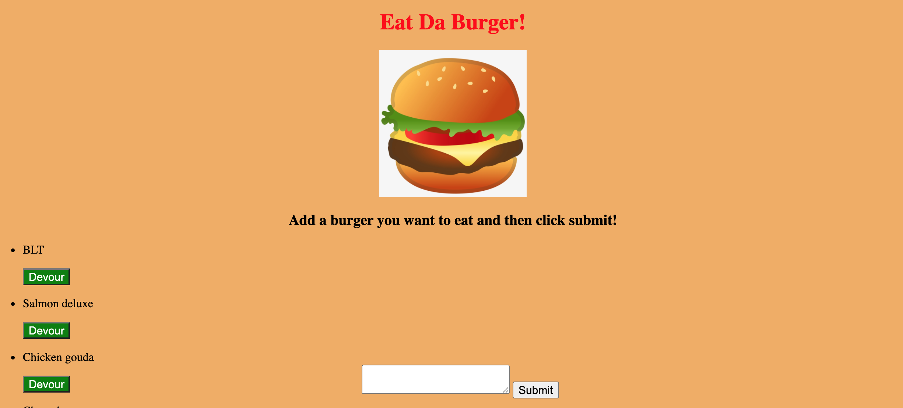

# Eat-Da-Burger!

This application includes a form where users can enter a burger that they would like to "eat". After clicking submit that burger is then added to a list of burgers that are available to devour. The user then has the option to click the "devour" button.

<strong>Repo Link:</strong> https://github.com/amay1421/burger-logger
   
<strong>Heroku Link:</strong> https://git.heroku.com/warm-brook-84152.git
